# Shesha Claude Designer

## Overview

**The conductor for design → on-brand Shesha app.** It does not author form JSON or pick colours — it ingests a design, turns each screen into a **measured layout blueprint**, plans the screens, and delegates: structure to `shesha-form-edit`, styling to `shesha-design-system`, and the placement comprehension + verification to `shesha-design-comprehension`. Its job is to make sure the built app *matches the design* — in layout (measured, not eyeballed) and in brand.

```dot
digraph { rankdir=LR;
  d [label="Claude design\n(source)"];
  ingest [label="1 ingest +\ntier detect"];
  comp [label="2 comprehend\n→ blueprints"];
  plan [label="3 plan screens"];
  build [label="4 build (form-edit)\n+ style (design-system)"];
  verify [label="5 verify:\nstructure · PLACEMENT · visual"];
  d -> ingest -> comp -> plan -> build -> verify;
  verify -> build [label="placement/visual\nmismatch → fix"];
}
```



## When to use

- **A design source exists** (prototype / kit / screenshots / runnable app) and the goal is to realise it in Shesha across one or more screens.
- **No design source, but the result has to look designed** — a prose brief naming several screens ("a 3-page flight booking system"), or any request carrying design intent ("make it look properly designed", "not default AntD"). This is a first-class path, not a fallback: see Step 1b.
- **Not** for "add a field to this form" (use `shesha-form-edit`) or "just theme this working form" (use `shesha-design-system`).

### Step R — route before paying for the pipeline

| Task shape | Route |
|---|---|
| Single screen, no design intent ("add a checkbox to X") | Hand the whole task to `Skill(shesha-developer:shesha-form-edit)` and stop. Conducting a one-screen edit is pure overhead. |
| Single screen + a real design source to measure | This pipeline, comprehension inline (no fan-out), placement gate on that one screen. |
| **2+ screens, with or without a design source** | **Full pipeline.** Fan out per screen. |
| An existing form that just looks wrong | `Skill(shesha-developer:shesha-design-system)` directly. |

When routing away, pass the full context (backend URL, credentials, module, `$RUN_DIR`) and let the other skill own the run end to end.

## Steps

> **The contracts between the four skills — what each hands over, gate order, sequencing rules —
> live in [references/handoff-contract.md](references/handoff-contract.md).** Read it once per
> session. It was previously reachable only from `README.md`, which nothing links, so the spine of
> the pipeline was effectively unreachable from its own entry point.

### Step 0 — Pre-flight: create the run directory (once per run, before anything else)

Everything this pipeline produces lands in **one** directory, `$RUN_DIR`, created now:

```
.claude/shesha/runs/<run-slug>/      ← $RUN_DIR, relative to the TARGET PROJECT root
  manifest.json                      run state: screens, plan, per-screen status, gate verdicts
  access-token                       BOM-free bearer token + fetchedAt
  screen-inventory.json              Step 1 output
  blueprints/<screen>.blueprint.md   Step 2 output
  probes/<screen>.<stage>.layout.json        stage = design | built-r1 | built-r2 …
  staged/<screen>.<stage>.form.json          stage = structure | styled | pushed
  screenshots/<screen>.<viewport>.<scroll>.png
  run-log.md                         one line per phase
```

Rules that make this worth doing:

- **`$RUN_DIR` goes in every dispatch prompt.** A sub-skill or agent that has to invent its own scratch location writes somewhere nobody looks. Wherever older docs say `<workdir>`, they mean `$RUN_DIR`.
- **Artifact names carry their own identity.** A screenshot called `screenshot-3.png` caused a wasted design-critic round-trip when the wrong scroll position was handed over; `<screen>.<viewport>.<scroll>.png` cannot make that mistake. Same for probes and staged markup — the stage is in the filename.
- **Handoffs pass paths, not blobs.** Return `staged/x.styled.form.json`, not its contents. Large JSON crossing an agent boundary is context spent on transport.
- **`manifest.json` is the run's memory.** The plan, build order and per-screen status live there, so a run survives compaction and can be resumed instead of re-derived. Update it at each phase boundary.
- **Absolute path, forward slashes.** On Windows write `<DRIVE>:/Users/.../.claude/shesha/runs/<slug>`, never a git-bash `/c/...` path: native Python and Node cannot open those, and the resulting `FileNotFoundError` looks exactly like a missing file. If a tool insists on relative paths, `cd` into `$RUN_DIR` first and use bare filenames.
- Add `.claude/shesha/runs/` to the project's `.gitignore`.

**This is not the cache.** `.claude/cache/shesha-form-edit/` is durable, cross-run and TTL'd (entity metadata, seeds, doc distillates); `$RUN_DIR` is one run and disposable. Keep them separate.

**Authenticate once** into `$RUN_DIR/access-token`, and stamp `fetchedAt` alongside it. Every reader checks the age before use and re-authenticates if stale — a token cached in a repo went five days out of date and cost a live debugging round-trip before anyone suspected it.

### Step 1 — Ingest the design
Identify and read the design source; detect its **fidelity tier** (readable source / runnable app / screenshots). Extract the **token set** (palette, type, spacing, radius, shadow, status lifecycle) and the **screen list**. Normalise mixed docs with markitdown for content only. Details: [references/design-ingestion.md](references/design-ingestion.md). Do NOT parse a compiled/offline single-file bundle — serve+run it instead.

### Step 1b — No design source? Derive the inputs instead (do NOT skip to building)

When there is nothing to measure, Step 1 still has to produce the same two artifacts — a **token set** and a **screen inventory**. Derive them:

1. **Brand: use the shipped default.** `shesha-design-system/assets/themes/shesha.tokens.json` is a complete brand — palette, type scale, spacing, radius, shadow, a five-tone status lifecycle and a ready `$antdTheme`. Resolve it and move on. **Do not author a new `<brand>.tokens.json`** just because the app sounds distinctive; brand authoring is a separate, explicitly-requested task and an easy way to sink a run's turns into a theme file nobody asked for. Use a custom brand only when the user names one or supplies tokens.
2. **Screen inventory: read it out of the brief.** Each screen the user names gets a row — name, archetype (from `shesha-form-edit/references/archetypes.md`), the entity it concerns, and its cross-links. "A bookings list, a create dialog and a details page" is three rows: `list-card`, `capture`, `record-detail`. Write it to `$RUN_DIR/screen-inventory.json` as usual.
3. **Ambiguity is a question, not a guess.** If the brief doesn't say whether "list" means a column grid or cards, ask — the two are different components and the wrong pick is a rebuild ([data-tables.md](../shesha-form-edit/references/components/data-tables.md)).

Then continue into Step 2 exactly as normal. **Everything downstream is unchanged** — this path produces a Tier D blueprint per screen instead of a Tier A/B/C one, and Tier D is a documented tier, not a shortcut.

**What this path must never become:** skipping the blueprint and handing `shesha-form-edit` a prose brief. That is the single failure this pipeline exists to prevent, and having no design source makes it *more* likely, not less — there is nothing to drift *from*, so nobody notices the drift. The archetype's default shape is the specification; write it down.

### Step 2 — Comprehend each screen into a layout blueprint  ← the placement spine
**REQUIRED SUB-SKILL:** `shesha-developer:shesha-design-comprehension`. For each screen, it produces `$RUN_DIR/blueprints/<screen>.blueprint.md` — an annotated layout blueprint with explicit grid columns/spans, nesting, tab assignment, bindings, and a placement `assertions` block. This is what stops container placement from drifting; do not skip it and hand `shesha-form-edit` a prose brief.

With a design source the layout is **measured** (Tier A/B/C). Without one it is **derived** from the archetype's default shape plus the resolved brand (**Tier D**) — same document, same downstream contract, provenance stamped honestly. Both are defined in that skill's [blueprint-ir.md](../shesha-design-comprehension/references/blueprint-ir.md).

### Step 3 — Establish the theme (once) + plan the screens
**First decide the brand.** If the user names a brand, hands over brand tokens, or an app-specific `<brand>.tokens.json` already exists → use that. If the design carries a distinct palette/type → author a new `<brand>.tokens.json` (copy the default, swap values). Otherwise → use the shipped **default `shesha`** brand. The selection rule + the folder to drop a custom brand file into live in `shesha-developer:shesha-design-system` (SKILL.md Step 1). Then hand the token set to `shesha-developer:shesha-design-system` to ensure the brand theme file exists and the app-level theme (primary, font, radius) is set **once**. Then map each design screen to a Shesha form type + archetype (read the archetype straight from each blueprint — don't re-derive it), **resolve each blueprint region to a block-library block** (`shesha-form-edit/assets/blocks` — e.g. `flex-split-main-rail`, `page-header-band`, `rail-panel`) **+ its paired style overlay/recipe** (`shesha-design-system`), so the per-screen plan is `{archetype, blocks[], recipes[]}`; and sequence the build order (list → detail → create is typical). Present the plan + blueprints + cost; gate on user confirmation (unless headless).

### Step 4 — Build each screen (delegate)
Per screen, in order:
- **(a) Structure — REQUIRED SUB-SKILL `shesha-developer:shesha-form-edit`:** pass the screen's `blueprint.md` as the requirements (archetype → seed/blocks, `layout-tree` spans → **flex `container` rows sized via `desktop.dimensions.width`** — never the `columns` component, `bindings` → component + propertyName). It builds native structure, wires CRUD, validates, pushes, publishes.
- **(b) Styling — REQUIRED SUB-SKILL `shesha-developer:shesha-design-system`:** apply the theme's per-component v7 style blocks to the built form. It returns the path to the styled JSON under `$RUN_DIR/staged/`; `shesha-form-edit` owns the single push path.

  **This step is not optional, and it is emphatically not optional when there was no design source.** A form that only ever gets structure is default AntD, and that is exactly the reported failure: *"the dialogs are unstyled AntD defaults… the 'warm' aesthetic is really just one cream background colour and doesn't extend into typography, spacing, or button colour."* On the Tier D path the brand file **is** the design — if it isn't applied, nothing else in the run makes the screen look designed. Every screen gets the pass, dialogs included; a dialog is a screen.

- **(c) Verify the artifact on disk before believing any of it** — read the staged file back and resolve every form it references against the backend. Exit `0` pass · `1` fail · `2` unreadable · `3` partial, and a partial is never a pass. Resolving cross-form references is what stops a screen going live pointing at a sibling that was never created.

### Step 5 — Verify (four gates, in order)
- **5a — Structural integrity:** archetype built, native components only, layout fully flexed, fields bound. Failures route back to `shesha-form-edit`, not on to styling.
- **5a.5 — PLACEMENT diff (REQUIRED `shesha-design-comprehension`):** re-probe the built, published, table→details-navigated form into `$RUN_DIR/probes/`; diff measured column membership / row grouping / nesting depth / tab assignment against the blueprint `assertions`; route concrete mismatches back to `shesha-form-edit`. Method: that skill's verification loop.
  **On Tier D, say what this gate did and did not prove.** It proves the build matches the archetype's intended structure — the split held, the rail didn't collapse, the tab kept its children. It does **not** prove a match to a user's design, because there wasn't one. Report it that way ([verification.md §0](../shesha-form-edit/references/verification.md)).
- **5b — Visual audit:** screenshot vs theme; `shesha-design-system` audit-mode returns prop-level fixes.
- **5c — Design critique (`shesha-developer:design-critic`):** dispatch the fresh-context judge with the screenshot, the probe, the placement outcome and the theme. It returns `excellent | acceptable | generic | broken` plus three ranked concrete fixes. **`generic` is the finding this gate exists for** — a run whose brief said "make it look designed" is not done at `generic`. Apply the fixes and re-run, or report the verdict verbatim with your disagreement; never overrule it silently. Cap at 2 fix cycles, then report honestly.

### Step 6 — Confirm
Summarise per screen (form id, blueprint tier + pass/fail, theme applied, `verify-artifact` verdict, critic verdict); cross-link screens (list→detail→create navigation). Anything unverified is reported UNVERIFIED — including "built but not visually checked" when the frontend wasn't running.

## Non-negotiables — conduct, don't build

- **Comprehend before building.** Every screen gets a blueprint (Step 2) before `shesha-form-edit` is invoked — measured at Tier A/B/C, derived from its archetype at Tier D. A prose layout description is the thing that drifts; never hand one to the builder in place of a blueprint. Having no design source is not an excuse to skip this — it is the case where drift is *hardest to notice*, because there is nothing to drift from.
- **No screen ships unstyled.** Structure alone is default AntD. The brand theme is applied to every screen, dialogs included, and on a no-design-source run the brand file is the only design there is.
- **Placement is verified, not assumed.** Gate 5a.5 re-measures the built form against the blueprint. No screen is "done" until its placement assertions pass.
- **Delegate ownership.** Structure = `shesha-form-edit`; styling = `shesha-design-system`; comprehension + placement verification = `shesha-design-comprehension`. This skill plans, sequences, and gates — it does not author JSON, pick hexes, or push.
- **One push path.** All writes go through `shesha-form-edit`.
- **Read the source, not the bundle.** Run/serve a compiled prototype and probe it (or read un-minified source); never parse a minified single-file bundle.
- **Honesty about gaps.** If a design detail can't be expressed in Shesha, say so — don't claim a pixel match that isn't achievable.

## Relationship to the other skills

| Concern | Skill |
|---|---|
| **Ingest design, plan screens, orchestrate, verify end-to-end** | **this skill** |
| Comprehend a design → measured layout blueprint + placement verification | `shesha-developer:shesha-design-comprehension` |
| Build correct structure, CRUD, validate, push | `shesha-developer:shesha-form-edit` |
| Map tokens → app theme + per-component v7 style blocks | `shesha-developer:shesha-design-system` |
