# Shesha Claude Designer

## Overview

**The conductor for design → on-brand Shesha app.** It does not author form JSON or pick colours — it ingests a design, turns each screen into a **measured layout blueprint**, plans the screens, and delegates: structure to `shesha-form-edit`, styling to `shesha-design-system`, and the placement comprehension + verification to `shesha-design-comprehension`. Its job is to make sure the built app *matches the design* — in layout (measured, not eyeballed) and in brand.

```dot
digraph { rankdir=LR;
  d [label="Claude design\n(source)"];
  ingest [label="1 ingest +\ntier detect"];
  comp [label="2 comprehend\n→ blueprints"];
  plan [label="3 plan screens"];
  build [label="4 build (form-edit)\n+ style (design-system)"];
  verify [label="5 verify:\nstructure · PLACEMENT · visual"];
  d -> ingest -> comp -> plan -> build -> verify;
  verify -> build [label="placement/visual\nmismatch → fix"];
}
```

## When to use

- A design source exists (prototype / kit / screenshots / runnable app) and the goal is to realise it in Shesha across one or more screens.
- **Not** for "add a field to this form" (use `shesha-form-edit`) or "just theme this working form" (use `shesha-design-system`).

## Steps

### Step 1 — Ingest the design
Identify and read the design source; detect its **fidelity tier** (readable source / runnable app / screenshots). Extract the **token set** (palette, type, spacing, radius, shadow, status lifecycle) and the **screen list**. Normalise mixed docs with markitdown for content only. Details: [references/design-ingestion.md](references/design-ingestion.md). Do NOT parse a compiled/offline single-file bundle — serve+run it instead.

### Step 2 — Comprehend each screen into a layout blueprint  ← the placement spine
**REQUIRED SUB-SKILL:** `shesha-developer:shesha-design-comprehension`. For each screen, it produces `<workdir>/blueprints/<screen>.blueprint.json` — a measured node tree with explicit grid columns/spans, nesting, tab assignment, bindings, and a placement `assertions` block (typed predicates, not prose). This is what stops container placement from drifting; do not skip it and hand `shesha-form-edit` a prose brief.

### Step 3 — Establish the theme (once) + plan the screens
**Resolve the brand — a lookup, not an authoring task.** Run `node ../shesha-design-system/scripts/resolve-brand.mjs [<brand>]`. It returns an existing brand file, or the shipped **default `shesha`** when the requested one does not exist. **Never author a new `<brand>.tokens.json` during a design run** — not because a design's palette looks distinct, and not because a blueprint's `theme:` field names a brand that has no file. A telemetry review found a run that burned most of its turns writing a ~290-key `skyline` brand with an `$antdTheme` block that no user had requested. Brand authoring is a separate, explicitly requested, separately costed task. Full rule: `shesha-developer:shesha-design-system` SKILL.md Step 1. Then hand the token set to `shesha-developer:shesha-design-system` to ensure the brand theme file exists and the app-level theme (primary, font, radius) is set **once**. Then map each design screen to a Shesha form type + archetype (read the archetype straight from each blueprint — don't re-derive it), **resolve each blueprint region to a block-library block** (`shesha-form-edit/assets/blocks` — e.g. `flex-split-main-rail`, `page-header-band`, `rail-panel`) **+ its paired style overlay/recipe** (`shesha-design-system`), so the per-screen plan is `{archetype, blocks[], recipes[]}`; and sequence the build order (list → detail → create is typical). Present the plan + blueprints + cost; gate on user confirmation (unless headless).

### Step 4 — Build each screen (delegate)
Per screen, in order:
- **(a) Structure — REQUIRED SUB-SKILL `shesha-developer:shesha-form-edit`:** pass the screen's `blueprint.json` as the requirements. This is a **compile, not an authoring task** — `shesha-form-edit` runs `scripts/compile-spec.mjs` on the blueprint, then `scripts/validate-form.mjs` on the result (zero Tier 1/2 findings required), then pushes and publishes. Full contract: `shesha-form-edit/references/compiling.md`.
- **(b) Styling — REQUIRED SUB-SKILL `shesha-developer:shesha-design-system`:** apply the theme's per-component v7 style blocks to the built form. It returns styled JSON; `shesha-form-edit` owns the single push path.

### Step 5 — Verify against the design (three gates, in order)
- **5a — Structural integrity:** archetype built, native components only, layout fully flexed, fields bound. Failures route back to `shesha-form-edit`, not on to styling.
- **5a.5 — PLACEMENT gate (REQUIRED `shesha-design-comprehension`):** re-probe the built, published, table→details-navigated form (`layout-probe.js`), then run `node ../shesha-design-comprehension/scripts/verify-placement.mjs <blueprint.json> <built.probe.json>` — **its exit code is the gate**, not a model judgement. Exit 0 only when every typed assertion (`same-cluster`, `parent-of`, `ratio`, `same-rowband`, `tab`) passes; a non-zero exit prints each failing assertion with the measured vs. asserted fact — route those concrete failures back to `shesha-form-edit`, rebuild, re-probe, re-run until clean. **Known gap, stated plainly:** `tab(a, key)` cannot evaluate against a real build yet — Ant Design hides inactive tab panes (`display:none`), and today's probe doesn't capture which tab an element sits under, so a `tab()` assertion currently reports as unresolvable (a failing/unevaluated result naming the missing `tabKey`) rather than passing. Do not describe tab placement as verified until the probe is extended to capture `tabKey`. Method: `shesha-developer:shesha-design-comprehension`'s `references/verification-loop.md`.
- **5b — Visual audit:** screenshot vs theme; `shesha-design-system` audit-mode returns prop-level fixes (suggestions).

### Step 6 — Confirm
Summarise per screen (form id, blueprint pass/fail, theme applied); cross-link screens (list→detail→create navigation).

## Non-negotiables — conduct, don't build

- **Comprehend before building.** Every screen gets a measured blueprint (Step 2) before `shesha-form-edit` is invoked. A prose layout description is the thing that drifts — never hand one to the builder in place of a blueprint.
- **Placement is verified by an exit code, not assumed or eyeballed.** Gate 5a.5 runs `verify-placement.mjs` against a re-probe of the built form; a screen is "done" only when that command exits 0 (every assertion PASS) — `tab()` assertions are the current exception (unresolvable, not passing — see Step 5).
- **Delegate ownership.** Structure = `shesha-form-edit`; styling = `shesha-design-system`; comprehension + placement verification = `shesha-design-comprehension`. This skill plans, sequences, and gates — it does not author JSON, pick hexes, or push.
- **One push path.** All writes go through `shesha-form-edit`.
- **Read the source, not the bundle.** Run/serve a compiled prototype and probe it (or read un-minified source); never parse a minified single-file bundle.
- **Honesty about gaps.** If a design detail can't be expressed in Shesha, say so — don't claim a pixel match that isn't achievable.

## Relationship to the other skills

| Concern | Skill |
|---|---|
| **Ingest design, plan screens, orchestrate, verify end-to-end** | **this skill** |
| Comprehend a design → measured layout blueprint + placement verification | `shesha-developer:shesha-design-comprehension` |
| Build correct structure, CRUD, validate, push | `shesha-developer:shesha-form-edit` |
| Map tokens → app theme + per-component v7 style blocks | `shesha-developer:shesha-design-system` |
